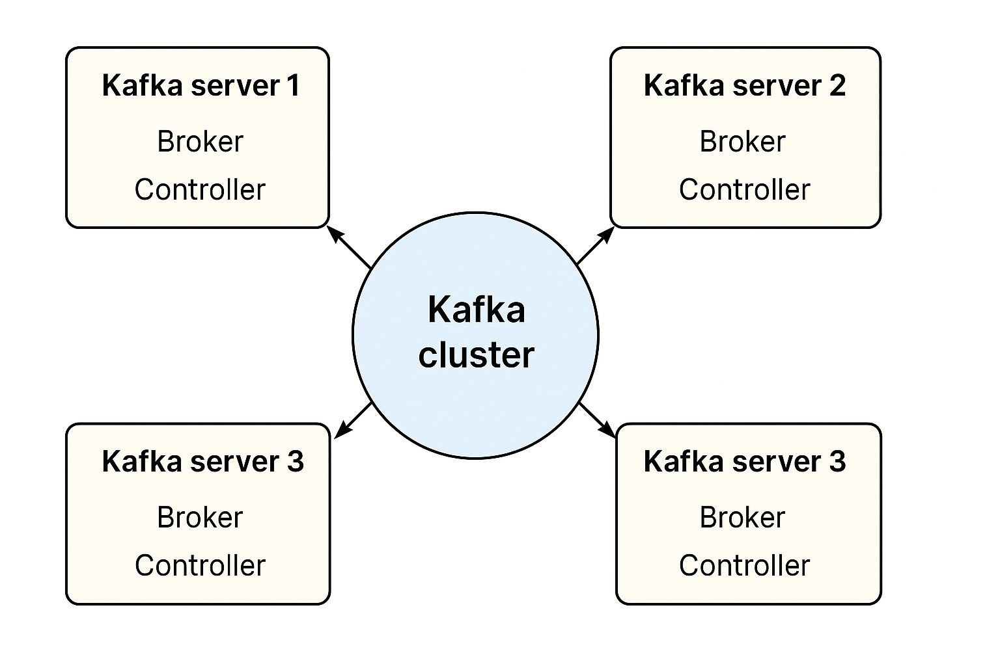

---

## 🧩 **Sequential Format: Step-by-Step Procedure**

### 🧠 Objective:

To start multiple Kafka servers (brokers + controllers) in **KRaft mode**, each with a separate configuration file.

---

### ⚙️ Steps:

1. **Create new configuration files**

    * Each Kafka server needs its own `server.properties` file.
    * Example:

      ```
      config/server.properties
      config/server-1.properties
      config/server-2.properties
      ```

2. **Assign a unique Node ID**

    * Open each configuration file and set a unique value for:

      ```
      node.id=<unique_number>
      ```

      Example:

      ```
      node.id=1
      node.id=2
      node.id=3
      ```

3. **Update listener ports**

    * Each server must have unique listener ports for the broker and controller.

      ```
      listeners=PLAINTEXT://:9092,CONTROLLER://:9093
      ```

      Example:

      ```
      server-1.properties → listeners=PLAINTEXT://:9094,CONTROLLER://:9095
      server-2.properties → listeners=PLAINTEXT://:9096,CONTROLLER://:9097
      ```

4. **Define controller quorum voters**

    * This property defines the list of all controllers (voters) in the KRaft cluster.

      ```
      controller.quorum.voters=1@localhost:9093,2@localhost:9095,3@localhost:9097
      ```
    * Use the same line in **all configuration files**.

5. **Update advertised listeners**

    * This defines how the broker advertises itself to clients.

      ```
      advertised.listeners=PLAINTEXT://localhost:9092
      advertised.listeners=PLAINTEXT://localhost:9094
      advertised.listeners=PLAINTEXT://localhost:9096
      ```

6. **Change log directory**

    * Each server needs a unique log directory.

      ```
      log.dir=/tmp/server-1/kraft-combined-logs
      log.dir=/tmp/server-2/kraft-combined-logs
      log.dir=/tmp/server-3/kraft-combined-logs
      ```

7. **Format storage directories**

    * Generate a new UUID:

      ```
      bin/kafka-storage.sh random-uuid
      ```
    * Use that UUID to format each server’s storage directory:

      ```
      bin/kafka-storage.sh format -t <UUID> -c config/server.properties
      bin/kafka-storage.sh format -t <UUID> -c config/server-1.properties
      bin/kafka-storage.sh format -t <UUID> -c config/server-2.properties
      ```

8. **Start each Kafka server**

    * Run each one in a separate terminal:

      ```
      bin/kafka-server-start.sh config/server.properties
      bin/kafka-server-start.sh config/server-1.properties
      bin/kafka-server-start.sh config/server-2.properties
      ```

---

## 🧾 **Tabular Format**

| **Step No.** | **Action**               | **Property / Command**                                                | **Example / Notes**                                                   |
| ------------ | ------------------------ | --------------------------------------------------------------------- | --------------------------------------------------------------------- |
| 1            | Create config files      | —                                                                     | `server.properties`, `server-1.properties`, `server-2.properties`     |
| 2            | Set unique Node IDs      | `node.id`                                                             | `1`, `2`, `3`                                                         |
| 3            | Update listener ports    | `listeners`                                                           | `PLAINTEXT://:9092,CONTROLLER://:9093` → Change ports for each server |
| 4            | Define controller quorum | `controller.quorum.voters`                                            | `1@localhost:9093,2@localhost:9095,3@localhost:9097`                  |
| 5            | Set advertised listeners | `advertised.listeners`                                                | `PLAINTEXT://localhost:9092`, etc.                                    |
| 6            | Change log directory     | `log.dir`                                                             | `/tmp/server-1/kraft-combined-logs`, etc.                             |
| 7            | Generate UUID            | `bin/kafka-storage.sh random-uuid`                                    | Use one UUID for all servers                                          |
| 8            | Format storage           | `bin/kafka-storage.sh format -t <UUID> -c config/server-x.properties` | Replace `<UUID>` with actual generated value                          |
| 9            | Start servers            | `bin/kafka-server-start.sh config/server-x.properties`                | Run each in separate terminal                                         |

---

## 🧩 **Comparison: Kafka Multi-Node (KRaft Mode) Configuration**

| **Property**                         | **server.properties (Node 1)**                       | **server-1.properties (Node 2)**                     | **server-2.properties (Node 3)**                     | **Explanation**                                                   |
| ------------------------------------ | ---------------------------------------------------- | ---------------------------------------------------- | ---------------------------------------------------- | ----------------------------------------------------------------- |
| **node.id**                          | `1`                                                  | `2`                                                  | `3`                                                  | Unique identifier for each Kafka server                           |
| **process.roles**                    | `broker,controller`                                  | `broker,controller`                                  | `broker,controller`                                  | Each node acts as both broker and controller                      |
| **listeners**                        | `PLAINTEXT://:9092,CONTROLLER://:9093`               | `PLAINTEXT://:9094,CONTROLLER://:9095`               | `PLAINTEXT://:9096,CONTROLLER://:9097`               | Separate ports for each node’s broker & controller listeners      |
| **advertised.listeners**             | `PLAINTEXT://localhost:9092`                         | `PLAINTEXT://localhost:9094`                         | `PLAINTEXT://localhost:9096`                         | Hostname and port advertised to clients                           |
| **controller.listener.names**        | `CONTROLLER`                                         | `CONTROLLER`                                         | `CONTROLLER`                                         | Defines which listener is used for inter-controller communication |
| **listener.security.protocol.map**   | `CONTROLLER:PLAINTEXT,PLAINTEXT:PLAINTEXT`           | `CONTROLLER:PLAINTEXT,PLAINTEXT:PLAINTEXT`           | `CONTROLLER:PLAINTEXT,PLAINTEXT:PLAINTEXT`           | Maps listener names to security protocols                         |
| **controller.quorum.voters**         | `1@localhost:9093,2@localhost:9095,3@localhost:9097` | `1@localhost:9093,2@localhost:9095,3@localhost:9097` | `1@localhost:9093,2@localhost:9095,3@localhost:9097` | List of all controller nodes in the quorum (same for all)         |
| **log.dir**                          | `/tmp/server-1/kraft-combined-logs`                  | `/tmp/server-2/kraft-combined-logs`                  | `/tmp/server-3/kraft-combined-logs`                  | Separate log directory for each node                              |
| **num.network.threads**              | `3`                                                  | `3`                                                  | `3`                                                  | Number of network threads for brokers                             |
| **num.io.threads**                   | `8`                                                  | `8`                                                  | `8`                                                  | I/O threads for handling requests                                 |
| **socket.send.buffer.bytes**         | `102400`                                             | `102400`                                             | `102400`                                             | Buffer sizes                                                      |
| **socket.receive.buffer.bytes**      | `102400`                                             | `102400`                                             | `102400`                                             | —                                                                 |
| **socket.request.max.bytes**         | `104857600`                                          | `104857600`                                          | `104857600`                                          | —                                                                 |
| **log.retention.hours**              | `168`                                                | `168`                                                | `168`                                                | Default log retention time                                        |
| **log.segment.bytes**                | `1073741824`                                         | `1073741824`                                         | `1073741824`                                         | —                                                                 |
| **num.partitions**                   | `1`                                                  | `1`                                                  | `1`                                                  | Default number of partitions                                      |
| **auto.create.topics.enable**        | `true`                                               | `true`                                               | `true`                                               | Auto topic creation enabled                                       |
| **delete.topic.enable**              | `true`                                               | `true`                                               | `true`                                               | Allow topic deletion                                              |
| **offsets.topic.replication.factor** | `3`                                                  | `3`                                                  | `3`                                                  | Replication factor for internal topics                            |
---
| **Aspect**            | **Description**                                                                 |
| --------------------- | ------------------------------------------------------------------------------- |
| **Total Servers**     | 3 Kafka servers (each acts as broker + controller)                              |
| **Ports Used**        | 9092–9097 (two per server)                                                      |
| **Node IDs**          | 1, 2, 3 (unique per server)                                                     |
| **Controller Quorum** | Shared across all servers: `1@localhost:9093,2@localhost:9095,3@localhost:9097` |
| **Logs**              | Unique directory per server under `/tmp`                                        |
| **UUID Formatting**   | One common UUID used when formatting storage for all 3 nodes                    |
| **Startup Commands**  | Run each with `bin/kafka-server-start.sh config/server-x.properties`            |
---
Perfect 👍 — here’s a **side-by-side comparison** of the three Kafka configuration files (`server.properties`, `server-1.properties`, and `server-2.properties`) for a **3-node Kafka KRaft cluster** setup.

---

---

## ⚙️ **Startup Commands Example**

```bash
# Format storage with same UUID for all
bin/kafka-storage.sh format -t <UUID> -c config/server.properties
bin/kafka-storage.sh format -t <UUID> -c config/server-1.properties
bin/kafka-storage.sh format -t <UUID> -c config/server-2.properties

# Start servers (each in a new terminal)
bin/kafka-server-start.sh config/server.properties
bin/kafka-server-start.sh config/server-1.properties
bin/kafka-server-start.sh config/server-2.properties
```



---
